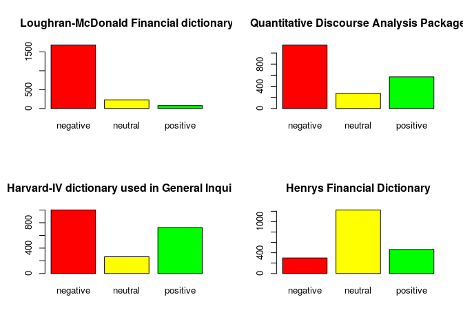
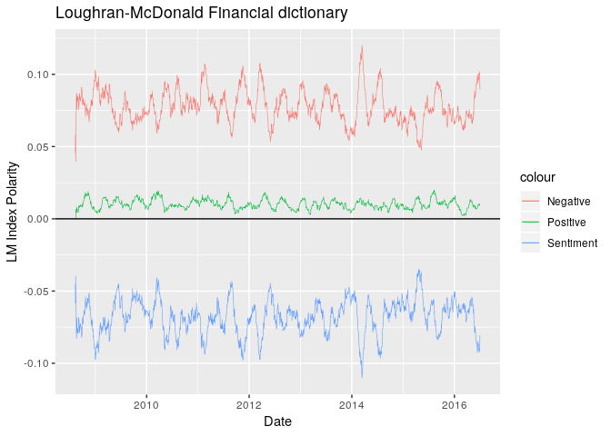
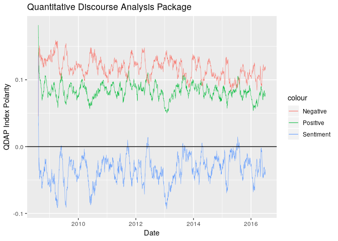
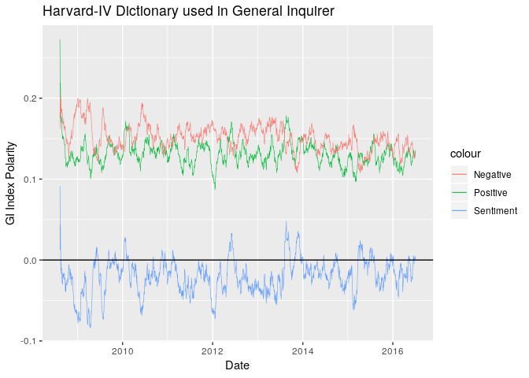
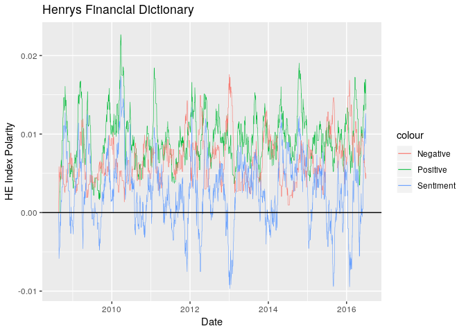

Comparison of Sentiment Analysis Dictionaries
================

#### Adam Kim

##### Presented as final project for ECO4390 (Data Science I) at Baylor University.

**sqldf** is used to run SQL queries on a dataframe.<br> **stringr** is used to cleaning text data.<br> **ggplot2** is used to visualize data.<br> **SentimentAnalysis** is used to compare different sentiment analysis libraries from various NLP pakcages.<br> **pracma** is used for smoothing time series data used in graphics.<br> **plyr** is used for dealing with high dimensional data.<br>

``` r
library("sqldf")
library("stringr")
library("ggplot2")
library('SentimentAnalysis')
library("pracma")
library("plyr")
```

This codeblock reads in downloaded data into two dataframes.<br>

boolNewsDF contains news headlines information only.<br>

djiaDF contains the Dow Jones Index only.

``` r
boolNewsDF  = read.csv("data/Combined_News_DJIA.csv",stringsAsFactors=F,na.strings="NA")
djiaDF      = read.csv("data/DJIA_table.csv",stringsAsFactors=F,na.strings="NA")

head(djiaDF)
```

    ##         Date     Open     High      Low    Close    Volume Adj.Close
    ## 1 2016-07-01 17924.24 18002.38 17916.91 17949.37  82160000  17949.37
    ## 2 2016-06-30 17712.76 17930.61 17711.80 17929.99 133030000  17929.99
    ## 3 2016-06-29 17456.02 17704.51 17456.02 17694.68 106380000  17694.68
    ## 4 2016-06-28 17190.51 17409.72 17190.51 17409.72 112190000  17409.72
    ## 5 2016-06-27 17355.21 17355.21 17063.08 17140.24 138740000  17140.24
    ## 6 2016-06-24 17946.63 17946.63 17356.34 17400.75 239000000  17400.75

This newscolumns vector contains column names corresponding to top 25 headlines on a given day.<br><br>

This codeblock uses a regex to only allow alphanumeric characters and converts all text to lowercase.

``` r
newscolumns = colnames(boolNewsDF, do.NULL = TRUE, prefix = "col")
newscolumns = tail(newscolumns,-2)
newscolumns
```

    ##  [1] "Top1"  "Top2"  "Top3"  "Top4"  "Top5"  "Top6"  "Top7"  "Top8" 
    ##  [9] "Top9"  "Top10" "Top11" "Top12" "Top13" "Top14" "Top15" "Top16"
    ## [17] "Top17" "Top18" "Top19" "Top20" "Top21" "Top22" "Top23" "Top24"
    ## [25] "Top25"

``` r
for(column in newscolumns)
{
     boolNewsDF[,column] = gsub("[^[:alnum:] ]", "", str_sub(boolNewsDF[,column], 3, -2))
     boolNewsDF[,column] = tolower(boolNewsDF[,column])
}

tail(boolNewsDF$Top1)
```

    ## [1] "vid cameron to resign as pm after eu referendu"                                                                                                                                                     
    ## [2] "rclays and rbs shares suspended from trading after tanking more than 8"                                                                                                                             
    ## [3] "500 scientists to australia if you want to save the great barrier reef stop supporting coa"                                                                                                         
    ## [4] "plosion at airport in istanbu"                                                                                                                                                                      
    ## [5] "maica proposes marijuana dispensers for tourists at airports following legalisation the kiosks and desks would give people a license to purchase up to 2 ounces of the drug to use during their sta"
    ## [6] "117yearold woman in mexico city finally received her birth certificate and died a few hours later trinidad alvarez lira had waited years for proof that she had been born in 1898"

``` r
rm(newscolumns)
```

This SQL statement creates a new dataframe that merges the news df and the Dow Jones df.

``` r
SELECT = 'SELECT *' 
FROM   = 'FROM djiaDF,boolNewsDF'
WHERE  = 'WHERE djiaDF.Date == boolNewsDF.Date'
ORDER  = 'ORDER BY djiaDF.Date ASC'

my_sql_statement = paste(SELECT,FROM,WHERE,ORDER,sep=' ')

sql_results      = sqldf(my_sql_statement)
```

This codeblock takes the top 3 headlines for a given day and combines the three headlines into a single column. This combined news headline will be used later for sentiment analysis.

``` r
columnlist = c()

for(i in 1:3) columnlist = c( columnlist , paste0("Top",i,sep='') ) 

sql_results$combined = do.call( paste, c( sql_results[columnlist] , sep = ' ' ) )
```

This codeblock uses SentimentAnalysis's function to generate sentiment values using 4 different major NLP libraries. <br> The convertToDirection function takes the numeric output from the analyzeSentiment function to sentiment tags "negative" "neutral" "positive".

``` r
headlines      = sql_results$combined

sentimentsAll  <- analyzeSentiment(headlines)

directionsSAP = convertToDirection(sentimentsAll)
```

This function quickly creates barplots for sentiment analysis.

``` r
to_barplot = function(inputDF,title)
{
  Z = count(inputDF)
  
  barplot(Z$freq,
          main = title,
          names.arg = as.character(Z$x),
          col = c('red','yellow','green') 
  )
}
```

Prepare dataframe from graphing news sentiments as time series data.

``` r
firstDifferences = diff(sql_results$Adj.Close, lag = 1, differences = 1)
firstDifferences = c(0.0,firstDifferences)
fdDF = as.data.frame(firstDifferences)
detailsAll = sentimentsAll
detailsAll$Date = as.Date(sql_results$Date)
detailsAll$Diff = fdDF$firstDifferences
detailsAll = detailsAll[-1,]
Date = as.Date(sql_results$Date)[-1]
```

**Loughran-McDonald Financial Dictionary** is developed by researchers at Notre Dame.<br> **Quantitative Discourse Analysis Package** is developed by Bryan Goodrich, Dason Kurkiewicz, Tyler Rinker.<br> **Harvard-IV Dictionary** is developed by researchers at Harvard.<br> **Henrys Financial Dictionary** was first presented in the Journal of Business Communication.<br> <br> These bargraphs display the number of headlines per day categorized as *negative, neutral, or positive* according to the different dictionaries.

``` r
par(mfrow=c(2,2)) # display 4 graphs simultaneously.

to_barplot(directionsSAP$SentimentLM,"Loughran-McDonald Financial dictionary")
to_barplot(directionsSAP$SentimentQDAP,"Quantitative Discourse Analysis Package")
to_barplot( directionsSAP$SentimentGI,"Harvard-IV dictionary used in General Inquirer")
to_barplot(directionsSAP$SentimentHE, 'Henrys Financial Dictionary')
```



``` r
par(mfrow=c(1,1)) # display single graph.
```

For each of the different sentiment dictionaries, visualize monthly moving averages of news sentiment over years 2008 to 2016.

``` r
H = 30

ggplot(data = detailsAll, aes(Date)) + 
  geom_line(aes(y = movavg(PositivityLM,H), colour = "Positive"),size=0.2) +
  geom_line(aes(y =  movavg(NegativityLM,H), colour = "Negative"),size=0.2) +
  geom_line(aes(y =  movavg(SentimentLM,H), colour = "Sentiment"),size=0.2) +
  geom_hline(aes(yintercept = 0)) + 
  ggtitle("Loughran-McDonald Financial dictionary") +
  labs(y = "LM Index Polarity")
```



``` r
ggplot(data = detailsAll, aes(Date)) + 
  geom_line(aes(y = movavg(PositivityQDAP,H), colour = "Positive"),size=0.2) +
  geom_line(aes(y =  movavg(NegativityQDAP,H), colour = "Negative"),size=0.2) +
  geom_line(aes(y =  movavg(SentimentQDAP,H), colour = "Sentiment"),size=0.2) +
  geom_hline(aes(yintercept = 0)) + 
  ggtitle("Quantitative Discourse Analysis Package") +
  labs(y = "QDAP Index Polarity")
```



``` r
ggplot(data = detailsAll, aes(Date)) + 
  geom_line(aes(y = movavg(PositivityGI,H), colour = "Positive"),size=0.2) +
  geom_line(aes(y =  movavg(NegativityGI,H), colour = "Negative"),size=0.2) +
  geom_line(aes(y =  movavg(SentimentGI,H), colour = "Sentiment"),size=0.2) +
  geom_hline(aes(yintercept = 0)) + 
  ggtitle("Harvard-IV Dictionary used in General Inquirer") +
  labs(y = "GI Index Polarity")
```



``` r
ggplot(data = detailsAll, aes(Date)) + 
  geom_line(aes(y = movavg(PositivityHE,H), colour = "Positive"),size=0.2) +
  geom_line(aes(y =  movavg(NegativityHE,H), colour = "Negative"),size=0.2) +
  geom_line(aes(y =  movavg(SentimentHE,H), colour = "Sentiment"),size=0.2) +
  geom_hline(aes(yintercept = 0)) + 
  ggtitle("Henrys Financial Dictionary") +
  labs(y = "HE Index Polarity")
```


