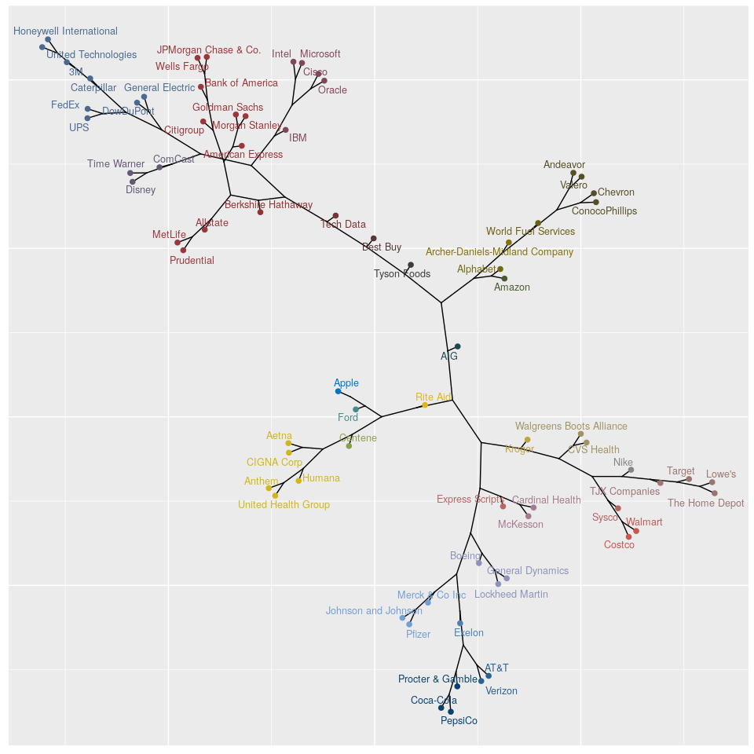

Hierarchal Clustering of the Fortune 100
================

#### Adam Kim

**stringr** is used to cleaning text data.<br> **factoextra & ape** are used to create phylogenic graphics.<br>

``` r
library(stringr)
library(factoextra)
library(ape)
require("igraph")
```

This function takes daily NYSE stock data (or NASDAQ) and takes the log difference on a single day lag.<br> This approximately calculates daily percentage change.

``` r
clean = function(df,title)
{
  tdf = subset(df,select=c('Date','Adj.Close'))
  
  names(tdf)[names(tdf)=='Adj.Close'] <- title
  
  adjCloseNum = as.numeric(tdf[,title])
  
  Log = log(adjCloseNum)
  
  diffLog = diff(Log)
  
  result = c(0.0,diffLog)

  tdf[,title] = result
  
  return(tdf)
}
```

This function translates stock index names to full names of the company.

``` r
full_name = function(stocks)
{
  fname = paste0( getwd() , '/__NAMES__.csv',sep='' )
  
  names = read.csv(file=fname, header=TRUE, sep=",")
  
  names$full = as.character(names$full)
  
  names$abbrev = as.character(names$abbrev)
  
  for( i in 1:length(stocks) )
  {
    idx = match( stocks[i] , names$abbrev )
    
    stocks[i] = names$full[idx]
  }
  
  return(stocks)
}
```

These functions serve to remove stock data for companies that had an IPO after 2005.<br> The dates are used as a key for the stock data dataframe, so including these young companies would result in data loss.<br> Any Fortune 100 companies with an IPO before 2005 were used for this project.

``` r
kick_all = function(heapcsv,badapples)
{
  for(i in 1:length(badapples) )
  {
    heapcsv = kick_single_item(heapcsv,badapples[i])
  }
  
  return(heapcsv)
}

kick_single_item = function(heapcsv,badapple)
{
  preN = length(heapcsv)
  
  badapple = paste('data/',badapple,'.csv',sep="")
  
  heapcsv = heapcsv[heapcsv != badapple]
  
  postN = length(heapcsv)
  
  stopifnot( postN < preN ) # check if removal occured
  
  return(heapcsv)
}
```

This block cleans the NYSE/NASDAQ stock data to only contain companies with an IPO before 2005.

``` r
library(stringr) # string manipulation

stocksCSV = list.files( paste0(getwd(),'/data',sep='')  )

badlist = c('PSX','DVMT','FB','MPC','HCA','GM','CHTR','DAL','ETE','UAL')

stocksCSV = paste0( 'data/',stocksCSV )

stocksCSV = kick_all(stocksCSV,badlist)

stocksCSV
```

    ##  [1] "data/AAPL.csv"  "data/ADM.csv"   "data/AET.csv"   "data/AIG.csv"  
    ##  [5] "data/ALL.csv"   "data/AMZN.csv"  "data/ANDV.csv"  "data/ANTM.csv" 
    ##  [9] "data/AXP.csv"   "data/BA.csv"    "data/BAC.csv"   "data/BBY.csv"  
    ## [13] "data/BRK-A.csv" "data/C.csv"     "data/CAH.csv"   "data/CAT.csv"  
    ## [17] "data/CI.csv"    "data/CMCSA.csv" "data/CNC.csv"   "data/COP.csv"  
    ## [21] "data/COST.csv"  "data/CSCO.csv"  "data/CVS.csv"   "data/CVX.csv"  
    ## [25] "data/DIS.csv"   "data/DWDP.csv"  "data/ESRX.csv"  "data/EXC.csv"  
    ## [29] "data/FDX.csv"   "data/FORD.csv"  "data/GD.csv"    "data/GE.csv"   
    ## [33] "data/GOOG.csv"  "data/GS.csv"    "data/HD.csv"    "data/HON.csv"  
    ## [37] "data/HUM.csv"   "data/IBM.csv"   "data/INT.csv"   "data/INTC.csv" 
    ## [41] "data/JNJ.csv"   "data/JPM.csv"   "data/KO.csv"    "data/KR.csv"   
    ## [45] "data/LMT.csv"   "data/LOW.csv"   "data/MCK.csv"   "data/MET.csv"  
    ## [49] "data/MMM.csv"   "data/MRK.csv"   "data/MS.csv"    "data/MSFT.csv" 
    ## [53] "data/NKE.csv"   "data/ORCL.csv"  "data/PEP.csv"   "data/PFE.csv"  
    ## [57] "data/PG.csv"    "data/PRU.csv"   "data/RAD.csv"   "data/SYY.csv"  
    ## [61] "data/T.csv"     "data/TECD.csv"  "data/TGT.csv"   "data/TJX.csv"  
    ## [65] "data/TSN.csv"   "data/TWX.csv"   "data/UNH.csv"   "data/UPS.csv"  
    ## [69] "data/UTX.csv"   "data/VLO.csv"   "data/VZ.csv"    "data/WBA.csv"  
    ## [73] "data/WFC.csv"   "data/WMT.csv"

``` r
stocks = str_sub(stocksCSV,6,str_length(stocksCSV)-4) # remove .csv

stocks = full_name(stocks)

n = length(stocks)
```

This block loops through the seperate stock datasets and merges them by date.

``` r
for(i in 1:n)
{
  
  z = read.csv(file=stocksCSV[i], header=TRUE, sep=",")
  
  z = clean(z,stocks[i]) # RENAME HERE
  
  if( i==1 )
  {stockData = z}
  else
  {stockData = merge(stockData,z,by='Date')}
}

head(stockData[,5:8])
```

    ##            AIG     Allstate       Amazon     Andeavor
    ## 1 -0.002432255  0.004470501 -0.018720895  0.032362552
    ## 2  0.009978384  0.009301758  0.022524551 -0.027674493
    ## 3 -0.003267732  0.002942393 -0.001519681 -0.008968749
    ## 4  0.001990498  0.005857817 -0.010191222 -0.012519416
    ## 5  0.009751885  0.013879112  0.031508593  0.012090482
    ## 6 -0.005217337 -0.009300751 -0.002733261 -0.009920778

This block removes any missing observations and converts dataframe into matrix.

``` r
stockData = na.omit(stockData)

stockData$Date = NULL

stockData = t(as.matrix(stockData))
```

This block runs the hierarchal clustering algorithm.

This block uses **TSclust** library to perform agglomerative clustering using *correlation* based distance.

The correlation metric utilized by **TSclust** maps from 0 to 2, where 0 implies no correlation and 2 implies perfect correlation.

``` r
library(TSclust)

D = diss(stockData,"COR")

summary(D)
```

    ##    Min. 1st Qu.  Median    Mean 3rd Qu.    Max. 
    ##   0.590   1.043   1.103   1.103   1.159   1.486

``` r
sort(rowMeans(as.matrix(D)))
```

    ##        Honeywell International            United Technologies 
    ##                      0.9874074                      0.9901765 
    ##                         Disney               American Express 
    ##                      1.0065237                      1.0084131 
    ##           JPMorgan Chase & Co.                     Prudential 
    ##                      1.0099120                      1.0108728 
    ##                 Morgan Stanley                             3M 
    ##                      1.0134942                      1.0157709 
    ##                  Goldman Sachs                        MetLife 
    ##                      1.0224760                      1.0228014 
    ##                            UPS                       Allstate 
    ##                      1.0251208                      1.0282269 
    ##                 The Home Depot               General Electric 
    ##                      1.0290436                      1.0317219 
    ##                         FedEx                         Chevron 
    ##                      1.0327174                      1.0351231 
    ##                    Caterpillar                    Wells Fargo 
    ##                      1.0371675                      1.0387619 
    ##                        ComCast                Bank of America 
    ##                      1.0408347                      1.0426072 
    ##                      DowDuPont               General Dynamics 
    ##                      1.0444004                      1.0514319 
    ##                    Time Warner                         Boeing 
    ##                      1.0518246                      1.0524373 
    ##                         Lowe's                          Cisco 
    ##                      1.0582835                      1.0606732 
    ##                           AT&T                      Citigroup 
    ##                      1.0607370                      1.0620268 
    ##                          Intel            Johnson and Johnson 
    ##                      1.0634211                      1.0636054 
    ##                            IBM                      Microsoft 
    ##                      1.0643801                      1.0673186 
    ##                         Oracle                        Verizon 
    ##                      1.0679786                      1.0751540 
    ##                 ConocoPhillips                         Pfizer 
    ##                      1.0765340                      1.0767685 
    ##               Procter & Gamble                           Nike 
    ##                      1.0796556                      1.0839674 
    ##             Berkshire Hathaway                  TJX Companies 
    ##                      1.0852018                      1.0890864 
    ##                         Target                     CIGNA Corp 
    ##                      1.0894148                      1.0894319 
    ##                      Coca-Cola                        Costco  
    ##                      1.0899199                      1.0908971 
    ##                         Valero                          Sysco 
    ##                      1.0926620                      1.0930267 
    ##                Lockheed Martin                        PepsiCo 
    ##                      1.0941190                      1.0969554 
    ##            United Health Group                          Aetna 
    ##                      1.1008610                      1.1044654 
    ##                Cardinal Health                       Andeavor 
    ##                      1.1139166                      1.1164368 
    ##                         Anthem Archer-Daniels-Midland Company 
    ##                      1.1164820                      1.1171126 
    ##                Express Scripts       Walgreens Boots Alliance 
    ##                      1.1182100                      1.1214000 
    ##                         Exelon                     CVS Health 
    ##                      1.1222676                      1.1227085 
    ##            World Fuel Services                       Alphabet 
    ##                      1.1246252                      1.1263436 
    ##                        Walmart                      Tech Data 
    ##                      1.1286399                      1.1295399 
    ##                       McKesson                 Merck & Co Inc 
    ##                      1.1314734                      1.1344233 
    ##                         Amazon                    Tyson Foods 
    ##                      1.1462585                      1.1464777 
    ##                       Best Buy                            AIG 
    ##                      1.1487126                      1.1608152 
    ##                         Humana                         Kroger 
    ##                      1.1641393                      1.1712828 
    ##                       Rite Aid                        Centene 
    ##                      1.1957774                      1.2063661 
    ##                           Ford                          Apple 
    ##                      1.3499282                      1.4273719

``` r
tree = hclust(D)

plot(tree) # vanilla graphics
```


This block generates the phylogenic graph.<br>

Companies towards the ends of branches are clustered together.<br> Companies in the center of the phylogenic graph have daily percentage stock movement that differ largely from the rest.<br>

``` r
K = 32

setting = 0.8

fviz_dend(tree, 
          k = K, 
          cex = setting, 
          k_colors = "jco",
          type = "phylogenic", 
          phylo_layout = "layout.auto",  
          color_labels_by_k = TRUE,
          ggtheme = theme_gray(),
          repel = TRUE)
```


